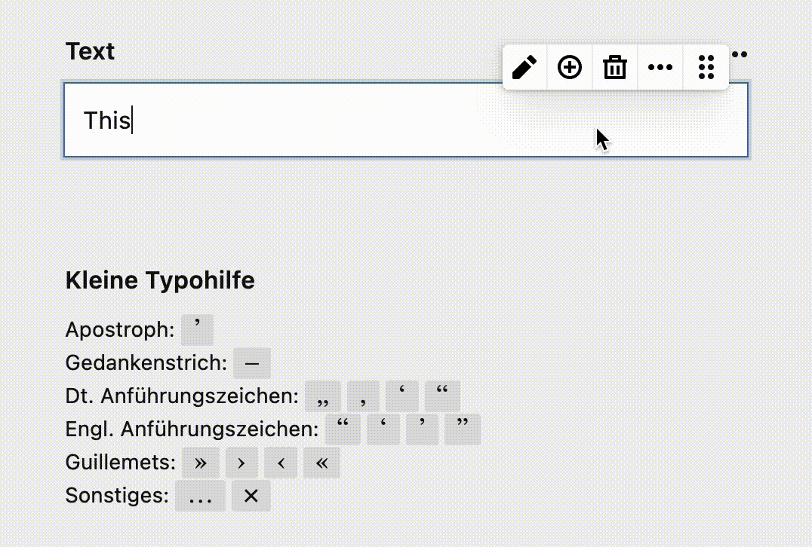

# Kirby Punctuation Section

This plugin provides a simple, **customizable** section for your Kirby project from which your clients can quickly copy commonly used characters to the clipboard.

Translated labels are supported as well. See [usage](#usage) below.

<br>



## Requirements

- Kirby 3.5+

## Installation

### Download

Download and copy this repository to `/site/plugins/kirby-punctuation-section`.

### Git Submodule

```bash
git submodule add https://github.com/johannschopplich/kirby-punctuation-section.git site/plugins/kirby-punctuation-section
```

### Composer

```bash
composer require johannschopplich/kirby-punctuation-section
```

## Usage

Create a `section/punctuation-helper.yml` in your blueprints folder and add characters you want to provide for clipboard copying.

A bare minimum section example:

```yaml
type: punctuation
headline: Lil Punctuation Helper
fieldsets:
  - category:
    label: German Quotation Marks
    chars:
      - "„"
      - "‚"
      - "‘"
      - "“"
```

Or use a more full fledged example, including support for **label translations**:

<details>

<summary>👀 Complete example</summary>

```yaml
type: punctuation
headline:
  de: Kleine Interpunktionshilfe
  en: Lil Punctuation Helper
fieldsets:
  - category:
    label:
      de: Apostroph
      en: Apostrophe
    chars:
      - "’"
  - category:
    label:
      de: Gedankenstrich
      en: Hyphen
    chars:
      - "–"
  - category:
    label:
      de: Dt. Anführungszeichen
      en: German Quotation Marks
    chars:
      - "„"
      - "‚"
      - "‘"
      - "“"
  - category:
    label:
      de: Engl. Anführungszeichen
      en: English Quotation Marks
    chars:
      - "“"
      - "‘"
      - "’"
      - "”"
  - category:
    label: Guillemets
    chars:
      - "»"
      - "›"
      - "‹"
      - "«"
  - category:
    label:
      de: Sonstiges
      en: Other
    chars:
      - "…"
      - "×"
```

</details>

Now, you're already good to go! Of course, you probably want to adapt the characters to your needs.

Include the freshly created section anywhere in your pages blueprints:

```yml
sections:
  punctuation: sections/punctuation-helper
```

## License

[MIT](./LICENSE) License © 2021 [Johann Schopplich](https://github.com/johannschopplich)
