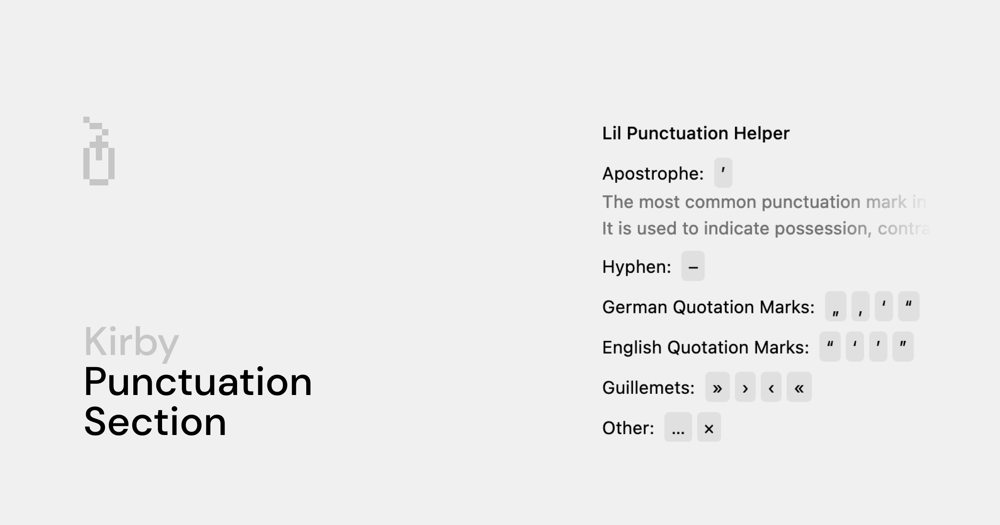

# Kirby Punctuation Section

This plugin provides a simple, **customizable** section for your Kirby project from which your customers can quickly add punctuation to their text or writer fields.

By default, clicking one of the punctuation buttons will insert the character at the current cursor position of a text or writer field.

## Features

- ♟️ Collect your favourite punctuation characters
- 🪡 Insert characters at the current cursor position
- 🖊️ Optionally paste characters to your clipboard
- 🌐 Fully Translatable

## Requirements

> [!NOTE]
> The current version of this plugin requires Kirby 4 or higher. For Kirby 3 support, please use version 2 of Kirby Punctuation Section.

## Installation

### Composer

```bash
composer require johannschopplich/kirby-punctuation-section
```

### Download

Download and copy this repository to `/site/plugins/kirby-punctuation-section`.

## Usage

To get started, create a `sections/punctuation.yml` file in your blueprints folder and add the characters you want to use to the `chars` array. A bare minimum section example looks like this:

```yaml
type: punctuation
label: Punctuations
fieldsets:
  - category:
    label: German Quotation Marks
    chars:
      - „
      - ‚
      - ‘
      - “
    help: This is a description for the category
```

After that, you can add the section to your blueprint like this:

```yml
sections:
  punctuation: sections/punctuation
```

## Clipboard API

Instead of inserting the given character at the current cursor position, you can also copy it to your clipboard by setting the `clipboard` option to `true`:

```yaml
type: punctuation
label: Punctuations
clipboard: true
```

> [!NOTE]
> The Clipboard API is only available for secure contexts, it cannot be used on non-HTTPS pages.
>
> Setting a browser flag can allow HTTP pages to be interpreted as secure, which can be useful for local development.

## Label Translations & Help Texts

Just like other Kirby built-in sections, the `label` and `help` fields can be translated.

Take a look at the section blueprint below for a full fledged example:

```yaml
type: punctuation
label:
  de: Kleine Interpunktionshilfe
  en: Lil Punctuation Helper
fieldsets:
  - category:
    label:
      de: Apostroph
      en: Apostrophe
    chars:
      - ’
    help:
      de: Das ist eine Beschreibung der Kategorie
      en: This is a description for the category
  - category:
    label:
      de: Gedankenstrich
      en: Hyphen
    chars:
      - –
  - category:
    label:
      de: Dt. Anführungszeichen
      en: German Quotation Marks
    chars:
      - „
      - ‚
      - ‘
      - “
  - category:
    label:
      de: Engl. Anführungszeichen
      en: English Quotation Marks
    chars:
      - “
      - ‘
      - ’
      - ”
  - category:
    label: Guillemets
    chars:
      - »
      - ›
      - ‹
      - «
  - category:
    label:
      de: Sonstiges
      en: Other
    chars:
      - …
      - ×
```

## License

[MIT](./LICENSE) License © 2021-PRESENT [Johann Schopplich](https://github.com/johannschopplich)
